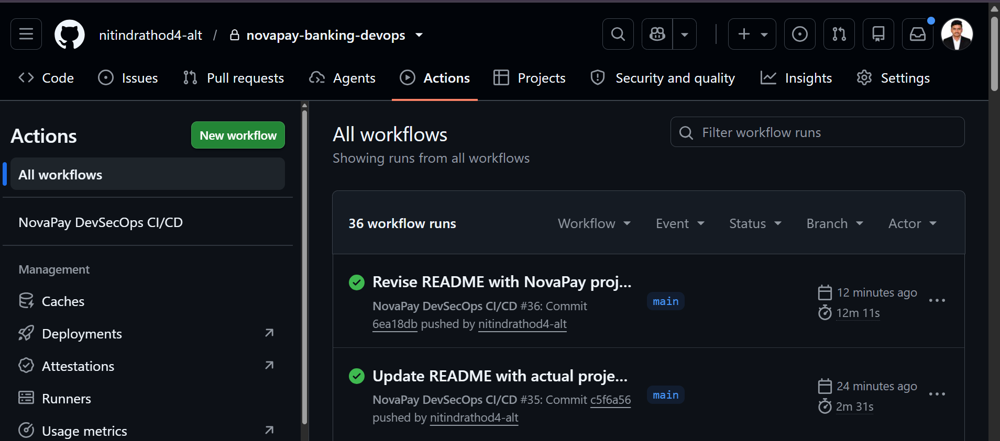
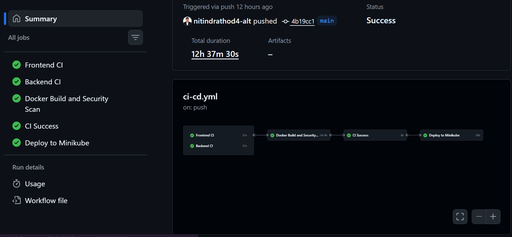

# 🏦 NovaPay — Digital Banking & DevSecOps Platform

> A full-stack digital banking application built with React and Node.js, backed by MongoDB and integrated with a containerized GitHub Actions CI/CD workflow.


---

## 📌 Project Overview

NovaPay is a full-stack digital banking application with separate user and administrator experiences. The application provides account and transaction workflows, KYC processing, support tickets, mobile recharge, bill payment, travel booking, statement/receipt generation, and administrative management features.

Alongside the application itself, the repository contains a DevSecOps-oriented delivery workflow that:

- builds the React frontend;
- validates the Node.js backend and controllers;
- builds backend and frontend Docker images;
- scans both images with Trivy;
- publishes commit-SHA-tagged images to Docker Hub; and
- deploys the resulting images to a Kubernetes/Minikube environment from a self-hosted GitHub Actions runner.

The implementation described here is based on the repository's current source files and workflow configuration. Infrastructure directories that currently contain only placeholders are explicitly marked below rather than presented as implemented features.

---

## 🎯 What This Project Demonstrates

| Area | Demonstrated Capability |
|---|---|
| Frontend | React, React Router, Vite, Axios, Recharts |
| Backend | Node.js, Express, REST APIs |
| Persistence | MongoDB with Mongoose |
| Authentication | JWT access/refresh tokens, bcrypt password hashing |
| Authorization | User/admin role checks |
| File Handling | Multer-based document/photo uploads |
| Email | Nodemailer with Gmail transport |
| Documents | PDF receipt/statement generation and Excel export support |
| Containers | Docker, Docker Compose |
| CI | GitHub Actions, npm CI/install, build and syntax validation |
| Security Scan | Trivy image scanning |
| Registry | Docker Hub |
| Deployment | Kubernetes/Minikube via a self-hosted runner |

---

## ✨ Key Application Features

### 👤 User Experience

- User registration and login
- JWT-based authentication
- Access token with 15-minute expiry
- Refresh token with 7-day expiry
- Forgot-password flow using email OTP
- Password reset and password change workflows
- Account balance and banking profile
- Cash deposit and withdrawal workflows
- User-to-user money transfers
- Transaction history and spending information
- Profile management
- Profile photo upload
- KYC submission and KYC status tracking
- Aadhaar/PAN document upload
- Mobile recharge
- Bill payment
- Support ticket creation and ticket history
- Travel/booking workflow
- Transaction statement download
- Individual transaction receipt download
- Notification settings

### 🛡️ Administrator Experience

The frontend includes a separate administrator routing experience with pages for:

- Dashboard
- User management
- Add/edit user
- User deposits and withdrawals
- Transaction administration
- Analytics
- User profiles
- Password reset administration
- KYC review
- Support ticket administration
- Administrator profile

Admin-only API routes are protected by both authentication and an explicit `role === "admin"` check.

---

## 🖼️ Screenshots / Evidence

A project screenshot is already committed to the repository, and CI/CD evidence images are also present at the repository root.

### Application / Project Evidence


### CI/CD Evidence





> Additional screenshot paths referenced by older documentation are not assumed to exist unless they are committed to the repository.

---

## 🏗️ System Architecture

```text
                              ┌───────────────────────┐
                              │        Browser        │
                              │   React + Vite App    │
                              └───────────┬───────────┘
                                          │
                                          │ Axios / REST
                                          ▼
                              ┌───────────────────────┐
                              │   Node.js + Express   │
                              │       REST API        │
                              └───────────┬───────────┘
                                          │
                                          │ Mongoose
                                          ▼
                              ┌───────────────────────┐
                              │        MongoDB        │
                              └───────────────────────┘

                         APPLICATION DELIVERY FLOW

Developer Push / Pull Request
            │
            ▼
        GitHub
            │
            ▼
   GitHub Actions
      ┌─────┴──────────────────────────────────────┐
      │                                             │
      ▼                                             ▼
Frontend CI                                   Backend CI
npm ci                                         npm ci
npm run build                                  node --check
      │                                             │
      └──────────────────┬──────────────────────────┘
                         ▼
                Docker Build
              ┌──────────┴──────────┐
              ▼                     ▼
        Backend Image         Frontend Image
              │                     │
              └──────────┬──────────┘
                         ▼
                    Trivy Scan
                         │
                         ▼
                     Docker Hub
                         │
                         ▼
               Self-hosted Runner
                         │
                         ▼
                  Kubernetes /
                    Minikube
                         │
                         ▼
                 Rollout Verification
```

### Architecture Notes

The backend starts an Express server on port `5000`, connects to MongoDB through `MONGO_URI`, serves uploaded files from `/uploads`, and exposes REST endpoints under `/api/*`. The frontend reads the API base URL from `VITE_API_URL` and automatically attaches the JWT access token to API requests.

---

## 🔄 How the Application Works

### Authentication flow

1. A user registers with a username and password.
2. The backend hashes the password with `bcryptjs` before storing it.
3. Login validates the credentials and returns a short-lived JWT access token plus a 7-day refresh token.
4. The frontend stores authentication state in `localStorage`.
5. Axios attaches the access token as `Authorization: Bearer <token>` for protected requests.
6. An HTTP `401` response clears the local authentication state and redirects the user to the root page.

### Banking flow

Authenticated requests can retrieve balances, deposit funds, withdraw funds, transfer funds to another user, and retrieve transaction history. Transactions are persisted as MongoDB documents and associate sender/receiver information where applicable.

### KYC flow

Users can submit KYC information, upload Aadhaar/PAN documents, and check KYC status. Admin-only routes allow administrators to view pending KYC records and approve or reject them.

### Operational delivery flow

A push or pull request targeting `main` triggers separate frontend and backend CI jobs. Once both succeed, the workflow builds Docker images, scans them with Trivy, pushes them to Docker Hub using the GitHub commit SHA as the image tag, and then updates the Kubernetes deployments on the configured self-hosted runner.

---

## 🧰 Tech Stack

| Layer | Technology | Status |
|---|---|---|
| UI | React 19 | Implemented |
| Routing | React Router DOM 7 | Implemented |
| Build Tool | Vite 8 | Implemented |
| HTTP Client | Axios 1 | Implemented |
| Charts | Recharts 3 | Implemented |
| Runtime | Node.js 20 | Used by CI/Docker |
| Web Framework | Express 5 | Implemented |
| Database | MongoDB | Implemented |
| ODM | Mongoose 9 | Implemented |
| Authentication | JSON Web Token | Implemented |
| Password Hashing | bcryptjs | Implemented |
| File Uploads | Multer | Implemented |
| Email | Nodemailer / Gmail | Implemented |
| PDF | PDFKit | Implemented |
| Excel | ExcelJS | Implemented |
| Containerization | Docker / Docker Compose | Implemented |
| CI/CD | GitHub Actions | Implemented |
| Image Security | Trivy | Implemented |
| Container Registry | Docker Hub | Implemented in workflow |
| Deployment Target | Kubernetes / Minikube | Referenced by workflow |
| Infrastructure as Code | Terraform | Not configured in current repository content |
| Helm | Helm | Not configured in current repository content |
| Kyverno / Rego | Policy as Code | Not configured in current repository content |
| Grafana | Observability | No executable configuration verified |
| AWS / EKS | Cloud deployment | Not configured in current repository content |

---

## 📂 Repository Structure

```text
novapay-banking-devops/
├── .github/
│   └── workflows/
│       └── ci-cd.yml
│
├── backend/
│   ├── config/
│   │   └── db.js
│   ├── controllers/
│   │   ├── adminKycController.js
│   │   ├── adminTicketController.js
│   │   ├── authController.js
│   │   ├── billController.js
│   │   ├── bookingController.js
│   │   ├── profileController.js
│   │   ├── publicController.js
│   │   ├── receiptController.js
│   │   ├── rechargeController.js
│   │   ├── statementController.js
│   │   ├── ticketController.js
│   │   ├── transactionController.js
│   │   ├── userController.js
│   │   └── withdrawalController.js
│   ├── middleware/
│   │   ├── adminMiddleware.js
│   │   ├── authMiddleware.js
│   │   └── upload.js
│   ├── models/
│   │   ├── BillPayment.js
│   │   ├── Booking.js
│   │   ├── Recharge.js
│   │   ├── Ticket.js
│   │   ├── Transaction.js
│   │   ├── User.js
│   │   └── WithdrawalRequest.js
│   ├── routes/
│   ├── utils/
│   ├── Dockerfile
│   ├── package.json
│   ├── package-lock.json
│   └── server.js
│
├── frontend/
│   ├── public/
│   ├── src/
│   │   ├── components/
│   │   ├── pages/
│   │   ├── services/
│   │   ├── App.jsx
│   │   ├── App.css
│   │   └── main.jsx
│   ├── Dockerfile
│   ├── package.json
│   ├── package-lock.json
│   ├── eslint.config.js
│   └── vite.config.js
│
├── pipeline/
│   ├── helm/
│   ├── policies/
│   ├── scripts/
│   ├── terraform/
│   └── .gitkeep
│
├── dashboards/
├── docs/
├── evidence/
├── docker-compose.yml
├── NovaPay-Transactions.xlsx
├── github-actions.png
├── github-actions-success.png
├── Screenshot 2026-08-23 025857.png
├── .gitignore
└── README.md
```

> The current repository also contains directories intended for future DevOps assets. Their presence alone is not treated as evidence that Terraform, Helm, policy files, dashboards, or deployment runbooks are implemented.

---

## 📦 Prerequisites

### Local development

- Node.js 20+
- npm
- Git
- MongoDB instance (local or hosted)

### Containers

- Docker
- Docker Compose

### CI/CD deployment environment

- `kubectl`
- Minikube or another reachable Kubernetes cluster
- Docker Hub access
- A configured self-hosted GitHub Actions runner with Docker and Kubernetes access

---

## ⚙️ Environment Variables

The backend loads environment variables with `dotenv`. MongoDB connectivity is configured through `MONGO_URI`; JWT signing uses `JWT_SECRET`; and password-reset email uses Gmail credentials.

### Backend: `backend/.env`

```env
PORT=5000
MONGO_URI=<your-mongodb-connection-string>
JWT_SECRET=<your-long-random-secret>
EMAIL_USER=<your-gmail-address>
EMAIL_PASS=<your-gmail-app-password-or-supported-credential>
```

### Frontend: `frontend/.env`

```env
VITE_API_URL=http://localhost:5000/api
```

> Never commit real secrets, credentials, JWT signing keys, or private database URLs.

---

## 🚀 Local Development

### 1. Clone

```bash
git clone https://github.com/nitindrathod4-alt/novapay-banking-devops.git
cd novapay-banking-devops
```

### 2. Start the backend

```bash
cd backend
npm install
npm start
```

For development with automatic restarts:

```bash
npm run dev
```

The backend exposes:

```text
GET /api/health
```

Expected response shape:

```json
{
  "status": "UP",
  "message": "NovaPay Backend is Healthy"
}
```

### 3. Start the frontend

In a second terminal:

```bash
cd frontend
npm install
npm run dev
```

### 4. Frontend build and lint

```bash
cd frontend
npm run build
npm run lint
```

---

## 🐳 Docker / Docker Compose

Both application tiers have Dockerfiles based on `node:20-alpine`.

### Build and start

```bash
docker compose build
docker compose up -d
```

### Verify

```bash
docker compose ps
docker ps
```

### Stop

```bash
docker compose down
```

### Ports

| Service | Container Port | Host Port |
|---|---:|---:|
| Backend | 5000 | 5000 |
| Frontend | 5173 | 5173 |

The Compose configuration injects `backend/.env` into the backend container and mounts `backend/uploads` into the container uploads directory.

---

## 🔐 Authentication & Authorization

Authentication is implemented with JWT and bcrypt password hashing.

- Passwords are hashed with `bcryptjs`.
- Access tokens use `JWT_SECRET` and expire after 15 minutes.
- Refresh tokens use `JWT_SECRET` and expire after 7 days.
- Protected endpoints expect `Authorization: Bearer <token>`.
- Admin endpoints require a valid JWT and `role === "admin"`.

### Authentication endpoints

| Method | Endpoint | Purpose |
|---|---|---|
| `POST` | `/api/auth/register` | Register a user |
| `POST` | `/api/auth/login` | Authenticate a user |
| `POST` | `/api/auth/forgot-password` | Send password-reset OTP |
| `POST` | `/api/auth/verify-otp` | Verify reset OTP |
| `PUT` | `/api/auth/reset-password` | Reset password |
| `POST` | `/api/auth/refresh-token` | Refresh authentication |
| `POST` | `/api/auth/logout` | Logout |

---

## 🔌 API Documentation

The backend mounts route modules under these API prefixes:

| Prefix | Purpose | Protection |
|---|---|---|
| `/api/auth` | Authentication and password flows | Mixed |
| `/api/users` | User management/profile operations | Route-level protection varies |
| `/api/profile` | Profile and KYC operations | JWT |
| `/api/transactions` | Banking transactions and balance | JWT |
| `/api/statement` | Statement download | JWT |
| `/api/admin` | KYC administration | JWT + admin |
| `/api/recharge` | Mobile recharge | JWT |
| `/api/bill` | Bill payment | JWT |
| `/api/tickets` | User support tickets | JWT |
| `/api/admin-tickets` | Admin support-ticket management | JWT + admin |
| `/api/receipt` | Receipt download | JWT |
| `/api/bookings` | Travel/booking workflows | JWT |
| `/api/withdrawals` | Withdrawal requests/approval | JWT |

### Important transaction endpoints

```text
GET  /api/transactions/balance
POST /api/transactions/deposit
POST /api/transactions/withdraw
POST /api/transactions/transfer
GET  /api/transactions/user/mobile/:mobileNumber
GET  /api/transactions/history
GET  /api/transactions/my-spending
GET  /api/transactions/all
GET  /api/transactions/filter
GET  /api/transactions/export
```

### KYC endpoints

```text
POST /api/profile/kyc
GET  /api/profile/kyc-status
POST /api/profile/upload
GET  /api/admin/kyc
PUT  /api/admin/kyc/:id/approve
PUT  /api/admin/kyc/:id/reject
```

### Support and service endpoints

```text
POST /api/tickets/
GET  /api/tickets/my
GET  /api/admin-tickets/
PUT  /api/admin-tickets/:id
POST /api/recharge/mobile
POST /api/bill/payment
POST /api/bookings/
GET  /api/bookings/my
```

> These endpoint paths are derived from the current route modules. Formal OpenAPI/Swagger documentation is not configured in the repository.

---

## 🗄️ Database

MongoDB is used as the application database through Mongoose.

```text
MONGO_URI
```

Current models include:

- `User`
- `Transaction`
- `BillPayment`
- `Booking`
- `Recharge`
- `Ticket`
- `WithdrawalRequest`

The `User` schema includes banking/account metadata, KYC fields, notification preferences, reset-OTP data, refresh-token state, and login-lock state.

No dedicated database migration framework was verified in the current repository.

---

## 🤖 AI / ML

No AI/ML model or AI API integration was verified in the current source code. AI functionality is therefore **not configured**.

---

## 🔄 CI/CD Pipeline

Workflow file:

```text
.github/workflows/ci-cd.yml
```

The workflow runs for pushes and pull requests targeting `main`.

### 1. Frontend CI

Runs on a self-hosted runner using Node.js 20:

```bash
npm ci
npm run build
```

### 2. Backend CI

Runs:

```bash
npm ci
node --check server.js
```

It also syntax-checks controller files under `backend/controllers`.

### 3. Docker build and security scanning

Images are built using commit-SHA tags:

```text
nitindrathod/novapay-backend:<commit-sha>
nitindrathod/novapay-frontend:<commit-sha>
```

Both images are scanned by Trivy for `CRITICAL` and `HIGH` vulnerabilities with `ignore-unfixed: true` and `exit-code: 0`.

**Important:** the current configuration reports findings but does not fail the workflow solely because Trivy finds vulnerabilities.

### 4. Docker Hub push

The workflow uses these GitHub Secrets:

```text
DOCKERHUB_USERNAME
DOCKERHUB_TOKEN
```

### 5. Kubernetes deployment

The deploy job runs on the self-hosted runner and updates:

```text
novapay-backend
novapay-frontend
```

It then restarts the deployments, waits for rollout status, and prints pods/services for verification.

---

## ☸️ Kubernetes Deployment

The workflow currently targets a Kubernetes environment described in the job as **Minikube**.

Useful commands:

```bash
kubectl get nodes
kubectl get pods
kubectl get deployments
kubectl get services
kubectl get events --sort-by=.lastTimestamp
```

Troubleshooting commands:

```bash
kubectl describe pod <pod-name>
kubectl logs <pod-name>
```

Rollout verification:

```bash
kubectl rollout status deployment/novapay-backend
kubectl rollout status deployment/novapay-frontend
```

> A concrete Kubernetes manifest set is not established by the current repository tree, so manifests are not documented here as if they were present.

---

## ☁️ AWS / Terraform / Helm Status

The repository contains placeholder directories under `pipeline/`:

```text
pipeline/helm/
pipeline/policies/
pipeline/scripts/
pipeline/terraform/
```

These are **not treated as implemented infrastructure** because the current tree does not provide verified Terraform modules, Helm charts, policy files, AWS/EKS configuration, or executable deployment assets in those paths.

---

## 🔒 Security Considerations

### Existing controls

- bcrypt password hashing
- JWT authentication
- admin role authorization
- environment-based secret configuration
- Bearer-token protection for protected APIs
- Trivy container scanning
- GitHub Secrets for Docker Hub credentials

### Production hardening recommendations

These are recommended improvements, not claims about the current implementation:

- Store JWT and email/database credentials in a dedicated secret manager.
- Use HTTPS for deployed environments.
- Add strict request validation for public APIs.
- Add rate limiting/brute-force protection to authentication endpoints.
- Avoid logging sensitive KYC/account data.
- Use managed object storage for uploaded documents at scale.
- Configure a non-zero Trivy failure threshold if vulnerabilities must block delivery.

---

## 🧪 Testing & Validation

The repository currently provides build, lint, and syntax validation rather than a full automated test suite.

### Frontend

```bash
cd frontend
npm ci
npm run lint
npm run build
```

### Backend

```bash
cd backend
npm ci
node --check server.js
```

The CI workflow additionally validates the syntax of backend controller files.

> No dedicated Jest, Vitest, Supertest, Cypress, Playwright, or equivalent automated test suite was verified in the current repository content.

---

## 🧯 Troubleshooting

### MongoDB connection failure

Check that `MONGO_URI` is present in `backend/.env` and that the MongoDB instance is reachable.

### `401 Invalid or Expired Token`

The frontend removes its stored token/user state after a `401` response. Sign in again and verify the backend `JWT_SECRET` is correctly configured.

### Email OTP not received

Verify `EMAIL_USER` and `EMAIL_PASS`. The backend configures Nodemailer to use Gmail.

### Frontend cannot reach backend

Check the frontend environment variable:

```env
VITE_API_URL=http://localhost:5000/api
```

Also confirm that the backend is listening on port `5000`.

### Kubernetes rollout failure

```bash
kubectl get pods
kubectl describe pod <pod-name>
kubectl logs <pod-name>
kubectl get events --sort-by=.lastTimestamp
```

Verify image availability, Kubernetes access from the runner, and the commit-SHA image tag being deployed.

### Trivy findings do not fail CI

This is expected with the current workflow because both Trivy steps use `exit-code: "0"`.

---

## 🚢 Deployment Checklist

### Application

- [ ] MongoDB is reachable
- [ ] `MONGO_URI` configured
- [ ] `JWT_SECRET` configured
- [ ] Email credentials configured when password reset email is required
- [ ] Frontend `VITE_API_URL` points to the deployed API

### GitHub Actions

- [ ] Self-hosted runner is online
- [ ] Docker is available on the runner
- [ ] `DOCKERHUB_USERNAME` configured
- [ ] `DOCKERHUB_TOKEN` configured
- [ ] Runner can reach Kubernetes

### Kubernetes

- [ ] `novapay-backend` deployment exists
- [ ] `novapay-frontend` deployment exists
- [ ] Target images are available in Docker Hub
- [ ] Rollouts complete successfully

---

## 🛣️ Future Improvements / Roadmap

- Add formal OpenAPI/Swagger documentation.
- Add unit and integration tests for authentication and transaction workflows.
- Add request validation and centralized error handling.
- Add structured logging and metrics.
- Add version-controlled Kubernetes manifests and/or Helm charts.
- Add Terraform infrastructure only when the AWS/EKS setup is implemented in code.
- Configure CI policy gates to fail on selected vulnerability thresholds.
- Add dependency and secret scanning.
- Introduce stronger production deployment strategies such as canary or blue/green releases.
- Move sensitive KYC documents to managed object storage in production.

---

## 🤝 Contributing

1. Create a feature branch.
2. Make focused changes and never commit secrets.
3. Run frontend lint/build and backend syntax validation.
4. Update documentation when behavior changes.
5. Open a pull request against `main` with a clear summary and testing notes.

---

## 📄 License

The backend package declares the `ISC` license. A top-level `LICENSE` file is not currently present in the repository.

---

## 👨‍💻 Author

**Nitin Rathod**

GitHub: [@nitindrathod4-alt](https://github.com/nitindrathod4-alt)

Repository: [novapay-banking-devops](https://github.com/nitindrathod4-alt/novapay-banking-devops)

---

## 🔗 Useful Links

- [Repository](https://github.com/nitindrathod4-alt/novapay-banking-devops)
- [CI/CD Workflow](./.github/workflows/ci-cd.yml)
- [Backend](./backend)
- [Frontend](./frontend)
- [Docker Compose](./docker-compose.yml)

---

## 💼 Recruiter Snapshot

**NovaPay** combines a full-stack digital banking application with a practical DevOps delivery workflow.

> **Core stack:** React · Vite · Node.js · Express · MongoDB · Mongoose · JWT · Docker · GitHub Actions · Trivy · Docker Hub · Kubernetes/Minikube

Relevant for roles involving **DevOps, DevSecOps, CI/CD, backend engineering, full-stack development, and cloud-oriented application delivery**.

---

> **Documentation principle:** This README is aligned with the repository's current implementation. Features or infrastructure that are not verifiably present are marked as not configured rather than described as completed.